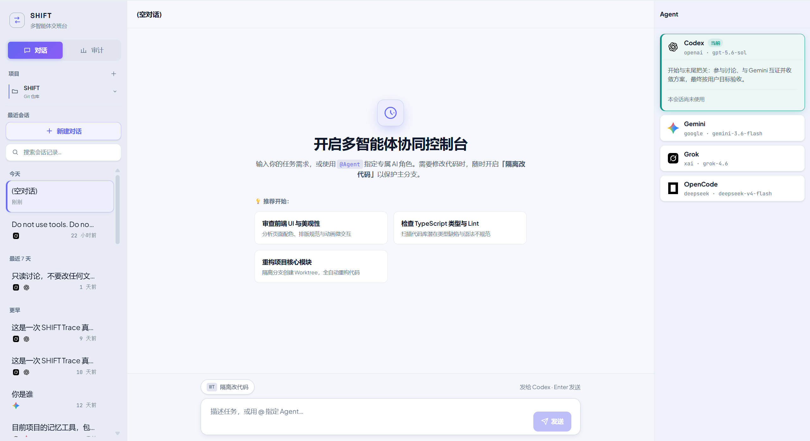

# SHIFT · 交班台

SHIFT 是面向个人用户的本地任务委托平台。用户描述目标，主 Agent 整理需求与分任务，平台选择本机已配置的 Agent CLI 组成 Team，负责执行和验收。SHIFT 不提供模型服务。



当前第一阶段接入内置软件交付流程。用户编辑委托草稿后提交，目标与范围随即冻结；平台按全局 FIFO 排队，一次执行一个委托。运行中可取消，需求变化建立关联新委托。

## 它实际解决什么

- **上下文不断档。** 委托保存冻结目标、节点依赖和成果；每次团队执行保留独立会话，后继节点收到前置节点已验收的成果版本。
- **完成有证据。** 方案、代码审查、commit、PR、CI 由平台对照 Git / GitHub 核对。Agent 说 done 不算完成。
- **主分支不被下手。** 改代码跑在任务自己的 Git worktree 里，聊天里能看到文件变更，不要的改动可以丢掉。
- **过程可回看。** 思考、工具、进度和失败断点进审计页，不是刷完就消失的终端日志。

提交是建立初始委托合同。执行中的方案批准、职责交接和最终验收由 Agent 与证据门禁推进。每个分任务是可领取节点，有独立 Team Run、尝试记录、成果版本和验收状态。Task 身份独立于执行会话。

## 一次典型任务

1. 新建委托，可选已有项目作为上下文；任务可无项目、无会话存在，软件团队执行时才建立独立工作空间。
2. 描述目标和材料，由主 Agent 在只读权限下整理草稿。
3. 编辑目标、交付物、完成条件和分任务后提交，平台保存 Team 绑定并入队。
4. 平台选择软件或材料分析团队；软件在专属 worktree 中实现和交付，材料在只读任务目录中分析、撰写和复核。展开执行细节可查看流式输出。
5. 软件团队核对 commit、PR、CI 和 Agent 验收并返回成果回执；平台在所有节点验收通过后完成任务。缺证据会明确标成未完成，成果目录及历史保留。

第一阶段沿用软件流程的 PR/CI 要求。没有配置远端的独立目录可保留实现成果，但不能获得完整交付终态。材料分析团队已接入；Windows 桌面封装和发布仍在后续阶段实现。

默认席位是本机的 Codex、Gemini、Grok、OpenCode、Claude Code。模型可以在本机改，SHIFT 不打包这些 CLI，也不管账号。

材料任务可粘贴文字或上传 UTF-8 TXT/Markdown：单份最多 64 KiB、最多 20 份、合计 256 KiB。提交固定材料版本；报告支持预览和下载，来源原文/行号/文件 hash 由平台核验，内容判断标为 Agent 审查（agent_reviewed）。无需 Git 远端。

## 上手

```bash
git clone https://github.com/TIME2ZY/SHIFT.git
cd SHIFT
npm ci
npm run storage:init-home
npm start
```

浏览器打开 [http://127.0.0.1:8787/](http://127.0.0.1:8787/)。第一版优先支持 Windows，需要 Node.js 20.19+、Git，以及已登录的 Codex 或 Claude Code 用于只读草稿整理。其他已配置的 CLI 可加入执行 Team。业务数据在 `~/.shift/data`，独立任务目录在 `~/.shift/tasks`。

从旧版本的仓库内数据库升级，用 `npm run storage:migrate-home`。开发时用 `npm run dev:web`。

环境变量见 [`.env.example`](.env.example)。工程约定、实现路径和设计决策见 [`AGENTS.md`](AGENTS.md)、[`docs/architecture-map.md`](docs/architecture-map.md)、[`docs/decisions/`](docs/decisions/)。
